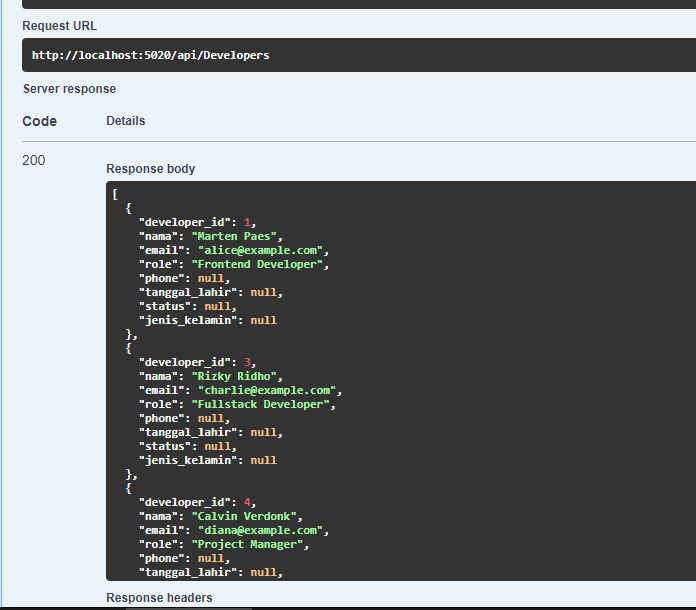

# TeamManagementAPI

API ini dirancang untuk membantu pengelolaan data terkait tim pengembang, proyek, tugas, laporan, serta hubungan antara pengembang dan proyek.

---

## 📜 Fitur Utama

- **Developer Management**: CRUD untuk data pengembang.
- **Project Management**: CRUD untuk data proyek.
- **Task Management**: CRUD untuk data tugas.
- **Report Management**: CRUD untuk data laporan.
- **Project-Developer Relationship**: Menyimpan hubungan antara pengembang dan proyek.

---

## 🔧 Teknologi yang Digunakan

- **.NET 8**: Framework utama untuk backend.
- **Entity Framework Core**: ORM untuk interaksi dengan PostgreSQL.
- **PostgreSQL**: Database yang digunakan.
- **Swagger**: Dokumentasi API otomatis.
- **CORS**: Mendukung integrasi frontend dengan konfigurasi CORS.

---

## 🛠️ Langkah Instalasi

1. Clone repository ini:
   ```bash
   git clone https://github.com/tkarombang/TeamManagementAPI.git
   cd TeamManagementAPI
   ```
2. Atur Koneksi Database (Backend Env)

- Buka File appsetting.json dan sesuaikan konfigurasi koneksi PostgreSQL [klik-disini](https://github.com/tkarombang/Backend_API-PostgreSQL_dotnet-8)

3. Jalankan Migrasi Database (Backend Env)

```bash
dotnet ef database update
```

2. Restore dependensi (Backend Env)

```bash
 dotnet restore
```

3. Jalankan aplikasi (Backend Env)

   ```bash
   dotnet run
   ```

4. Akses Swagger di browser
   buka http://localhost:5020/swagger (sesuaikan dengan port anda)

## Endpoint API

| Endpoint               | Metode | Deskripsi                        |
| ---------------------- | ------ | -------------------------------- |
| /api/Developers        | GET    | Menampilkan semua data developer |
| /api/Projects          | GET    | Menampilkan semua data proyek    |
| /api/Tasks             | GET    | Menampilkan semua data tugas     |
| /api/Reports           | GET    | Menampilkan semua laporan        |
| /api/ProjectDevelopers | GET    | Menampilkan hubungan proyek-dev  |

## Kontribusi

- Muhammad Azwar Anas aka (TKarombang)

# 🌟 Keunggulan Proyek

- Desain Modular: Struktur direktori yang terorganisir untuk pemeliharaan dan pengembangan berkelanjutan
- Skalabilitas: Mendukung penambahan fitur baru seperti tabel baru tanpa memengaruhi modul yang ada
- API First: Dokumentasi API tersedia otomatis untuk mempermudah integrasi dengan frontend atau aplikasi lain

# 🖼️ Tangkapan Layar



# 👨‍💻 Tentang Pengembang

* Nama: Muhammad Azwar Anas
* Peran: Backend Developer
* Project ini adalah bagian dari portfolio untuk menunjukkan keahlian dalam:

- Pembuatan API RESTful dengan ASP.NET Core
- Pengelolaan database relasional menggunakan PostgreSQL
- Penggunaan Swagger untuk dokumentasi API

Linkedin: https://linkedin.com/in/muhanaz

# 🚀 Pengembangan Selanjutnya

Menambahkan autentikasi dan otorisasi.
Menyediakan endpoint untuk analitik laporan.
Menambahkan fitur export data ke file CSV atau PDF.
